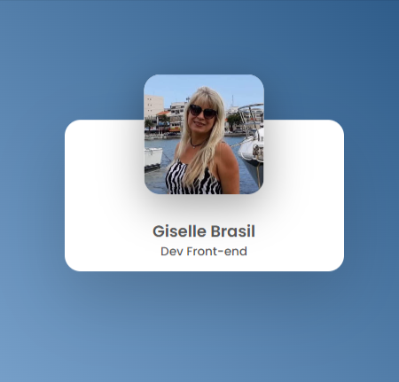
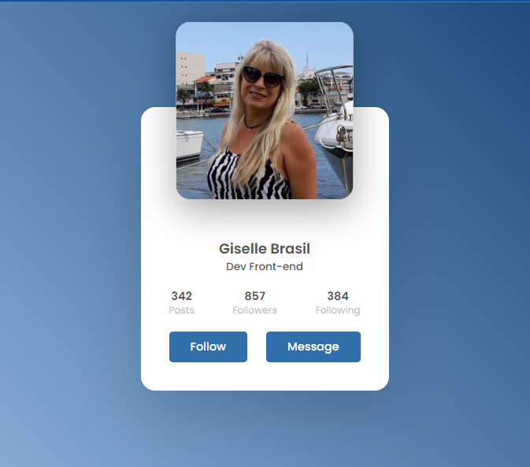

# Profile Card

## Projeto de um Profile Card utilizando apenas HTML e CSS
 
 

       

 

- Na imagem 2 ao passar o mouse sobre o card, tanto o card quanto a imagem aumentam de tamanho.

- Na imagem 3 ao passar o mouse sobre o botão, ele muda de cor.

 
 
Foram trabalhados conceitos básicos de programação web, tais como:

- HTML Semântico
- Flexbox
- animações - transition e transform

O projeto ainda vai ser melhorado.
          

 

## Como me encontrar nas redes sociais:   

 

### Contato:   - 📫  gisellemacedo.dev@gmail.com   

